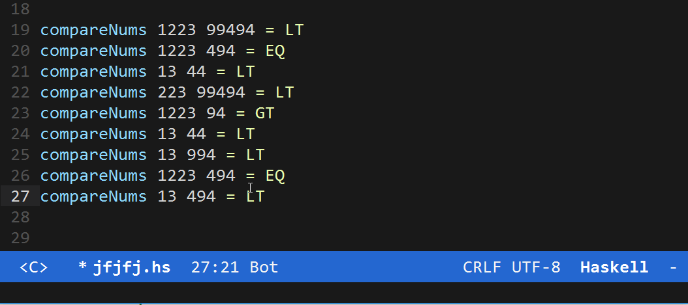

# Fast Exec (fast-exec.el)
`fast-exec.el` is awesome package for Emacs, it's mark executing command ("M-x") as very fast task.

## Cool Demo



## Get Start
Install this package, for example with current command, in this example user save all packages in `.emacs.d/lisp`:
```bash
cd .emacs.d/lisp
git clone https://github.com/semenInRussia/fast-exec.el.git
```


For get start paste folowed code to your Emacs init file:
```emacs-lisp

(require 'fast-exec)
(fast-exec/initialize)

```


## Usage

By default, for run `fast-exec/exec` you must press to `M-a` keymap, but you can change this keymap.

`fast-exec/exec` is main function of `fast-exec.el`, it's view hints buffer, which contain some pair of letter and command's name, letter you must press on letter for running command with corresponding name.

## Customization

### Customizate Keymap for call fast-exex/exec

By default you must press `M-a` keymap for run `fast-exec/exec`, but you can change this keymap, for its set `fast-exec/keymap-prefix`. For example, folowed code:

```emacs-lisp

(setq fast-exec/keymap-prefix "M-l")

```

### Define Keymaps

For defining keymaps you must use functions `fast-exec/register-keymap-function`, this function take 1 argument: function, this function must return list of `full-command`-s. Example:

```emacs-lisp

(fast-exec/register-keymap-func (lambda ()
                                    (list (fast-exec/full-command "Call Foo" 'foo))))
; About function `fast-exec/full-command` read text below!

```

Note: I am not use for this situation basic list, because
if user change mine list of keymaps, for valid updating
"fast-exec/full-commands", user must delete your old keymaps' version,
but if user and `fast-exec` use chain of functions, then after
updating any function `fast-exec/full-commands` set to nil, and all
 functions call again.

Full command is special type of `fast-exec.el`, which content understand don't required.

For creating `full-command` you can use 2 folowed functions: `fast-exec/full-command` and `fast-exec/some-commands`. As you can predict, `fast-exec/full-command` create 1 command and `fast-exec/some-commands` create some commands.

`fast-exec/full-command` take 2 arguments: name of command and command. `name` of command also it's letters which you canpress after call `fast-exec/exec` for call `command`. Be careful with case of words of `name`, words with first lower letter will ignore. `command` is interactive symbolic funtion's name. Example:

```emacs-lisp

(fast-exec/full-command "Call My the Function" 'my-function)
;                       ^                       ^
;                       |                       |
;For call `my-function` press cmf               |
;Word "the" is ignored, because                 |
;first letter in lower case                     |
                                        ;`my-function` is interactive func
                                        ;Here used quote
```

`fast-exec/some-commands` take infinity arguments. This arguments is pairs of command and name, but also different from `fast-exec/full-command` is that function don't need to quote. Example:

```emacs-lisp

(fast-exec/some-commands
 ("Call Function Foo" foo)
 ("Call Function Bar" bar))
;                     ^
;                     |
;                Not quote!

```
